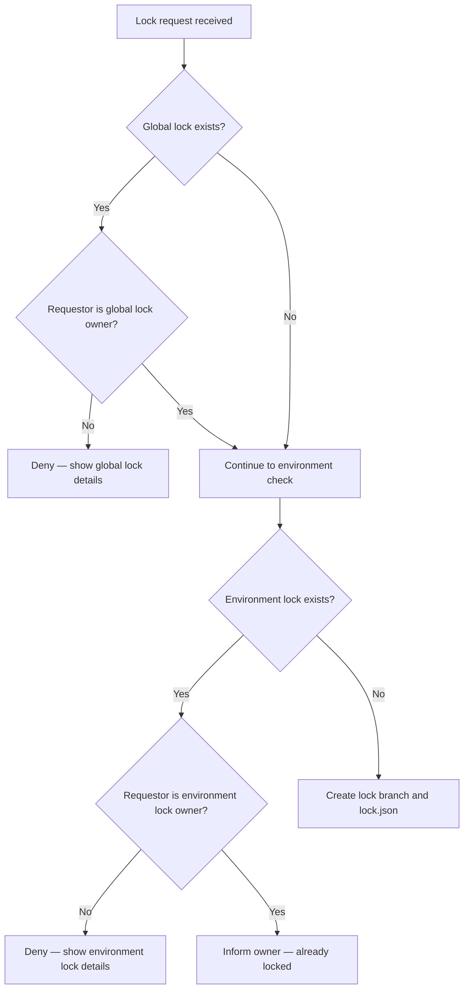

The Lock Action uses Git itself as its storage backend. There are no external databases or services — lock state is persisted directly in your repository as a branch and a JSON file.

## Lock storage mechanism

When a lock is acquired, the Action creates a dedicated Git branch in your repository and writes a `lock.json` file to it. The branch name encodes both the environment and the lock type, making it easy to inspect lock state at a glance in the GitHub UI.

**Branch naming convention:**

| Lock type | Branch name |
|---|---|
| Environment lock | `{environment}-branch-deploy-lock` |
| Global lock | `global-branch-deploy-lock` |

**Examples:**
- `production-branch-deploy-lock`
- `staging-branch-deploy-lock`
- `global-branch-deploy-lock`

### The lock.json file

The `lock.json` file is committed to the lock branch and contains all metadata about the active lock:

```json
{
  "reason": "deploying critical fix",
  "branch": "feature/my-branch",
  "created_at": "2024-01-15T10:30:00.000Z",
  "created_by": "octocat",
  "sticky": true,
  "environment": "production",
  "global": false,
  "unlock_command": ".unlock production",
  "link": "https://github.com/owner/repo/pull/123#issuecomment-456"
}
```

| Field | Description |
|---|---|
| `reason` | The reason provided when the lock was claimed (or `"deployment"` for non-sticky locks) |
| `branch` | The branch that claimed the lock, or `"headless mode"` when run without IssueOps |
| `created_at` | ISO 8601 timestamp of when the lock was created |
| `created_by` | GitHub username of the lock owner |
| `sticky` | Whether the lock persists until explicitly unlocked |
| `environment` | The environment this lock applies to (e.g., `production`) |
| `global` | `true` if this is a global lock covering all environments |
| `unlock_command` | The exact IssueOps command to release this lock |
| `link` | Link to the PR comment or Actions run that claimed the lock |

## Lock lifecycle

<Steps>
  <Step title="Lock requested">
    The Action is triggered — either by an IssueOps comment (`.lock production`) or in headless mode (`mode: lock`). Before doing anything else, it checks for an active **global lock** on the `global-branch-deploy-lock` branch. If a global lock exists and the requestor is not its owner, the request is denied immediately.
  </Step>
  <Step title="Environment lock checked">
    If no blocking global lock exists, the Action checks for an existing lock on the target environment's branch (e.g., `production-branch-deploy-lock`). If a lock file exists there and is owned by another user, the Action fails with full lock details.
  </Step>
  <Step title="Lock acquired">
    If no conflicting lock exists, the Action creates the lock branch (branching from the repo's default branch) and commits `lock.json` to it. The lock is now held by the requestor.
  </Step>
  <Step title="Lock contested">
    If a lock already exists and is owned by a different user, the Action posts details about the current lock owner, the lock age, and the unlock command — then exits with a failure status.
  </Step>
  <Step title="Lock released">
    When `.unlock` is called (or `mode: unlock` in headless mode), the Action deletes the lock branch via the Git refs API (`DELETE /repos/{owner}/{repo}/git/refs/heads/{branch}`). No branch means no lock.
  </Step>
</Steps>

<Note>
If you are already the owner of the lock and run `.lock` again, the Action will inform you of your existing lock and its age rather than failing. You remain the lock owner.
</Note>

## Sticky vs non-sticky locks

Locks have two persistence modes that control when they are automatically released.

<CardGroup cols={2}>
  <Card title="Sticky locks" icon="thumbtack">
    Created by the `.lock` IssueOps command or headless `mode: lock`. These locks persist indefinitely until someone explicitly runs the unlock command. They survive branch merges and deletions.
  </Card>
  <Card title="Non-sticky locks" icon="clock">
    Set internally during active deployments triggered by branch-deploy workflows. These locks are automatically cleaned up when the deployment branch is merged or deleted — no manual unlock required.
  </Card>
</CardGroup>

The `sticky` field in `lock.json` records which type a lock is. Non-sticky locks use `"deployment"` as the auto-populated reason.

## Global lock check order

The Action always checks for a global lock **before** checking any environment-specific lock. This ensures the global lock owner has full precedence over all environments.



## Permission check

Before any lock operation is processed in IssueOps mode, the Action verifies that the triggering user has `write` or `admin` collaborator permissions on the repository. Users with `read` or `none` permission are rejected before any lock state is inspected or modified.

<Warning>
Permission checks apply only to IssueOps-triggered runs. Headless mode (`mode: lock`, `mode: unlock`, `mode: check`) relies on the permissions of the GitHub Actions workflow itself via `github_token`.
</Warning>

## Related concepts

<CardGroup cols={2}>
  <Card title="Environments" icon="layers" href="/concepts/environments">
    Learn how each environment gets its own independent lock branch and how to configure custom environment targets.
  </Card>
  <Card title="Global locks" icon="globe" href="/concepts/global-locks">
    Understand how a global lock blocks all environments simultaneously and when to use one.
  </Card>
</CardGroup>
